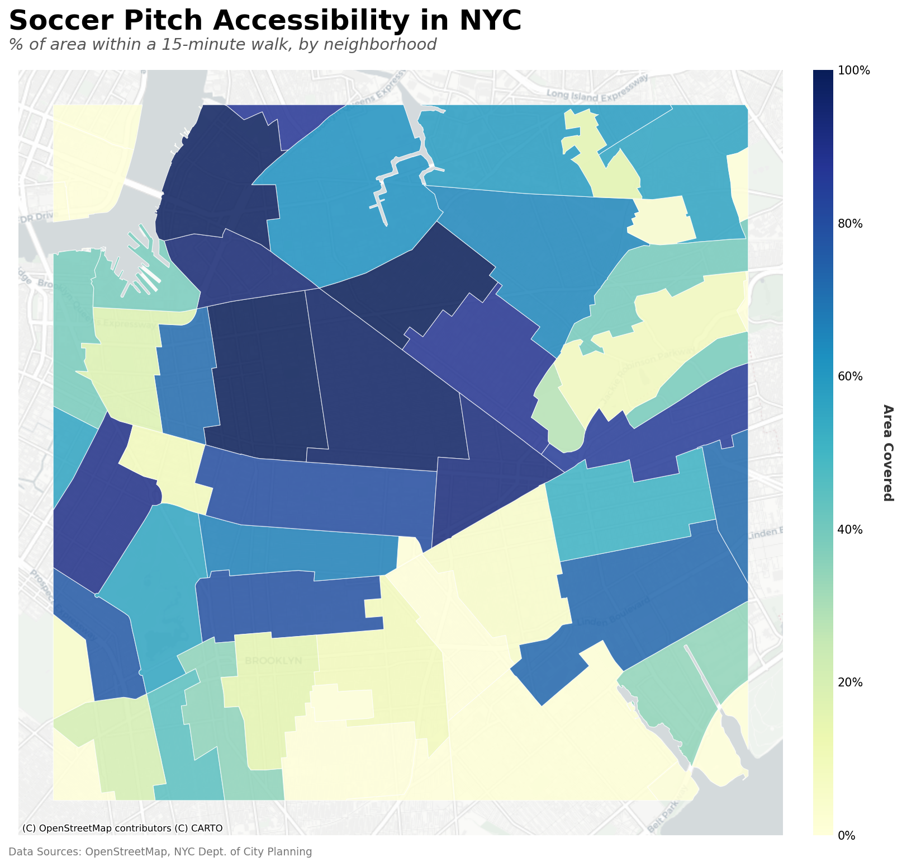
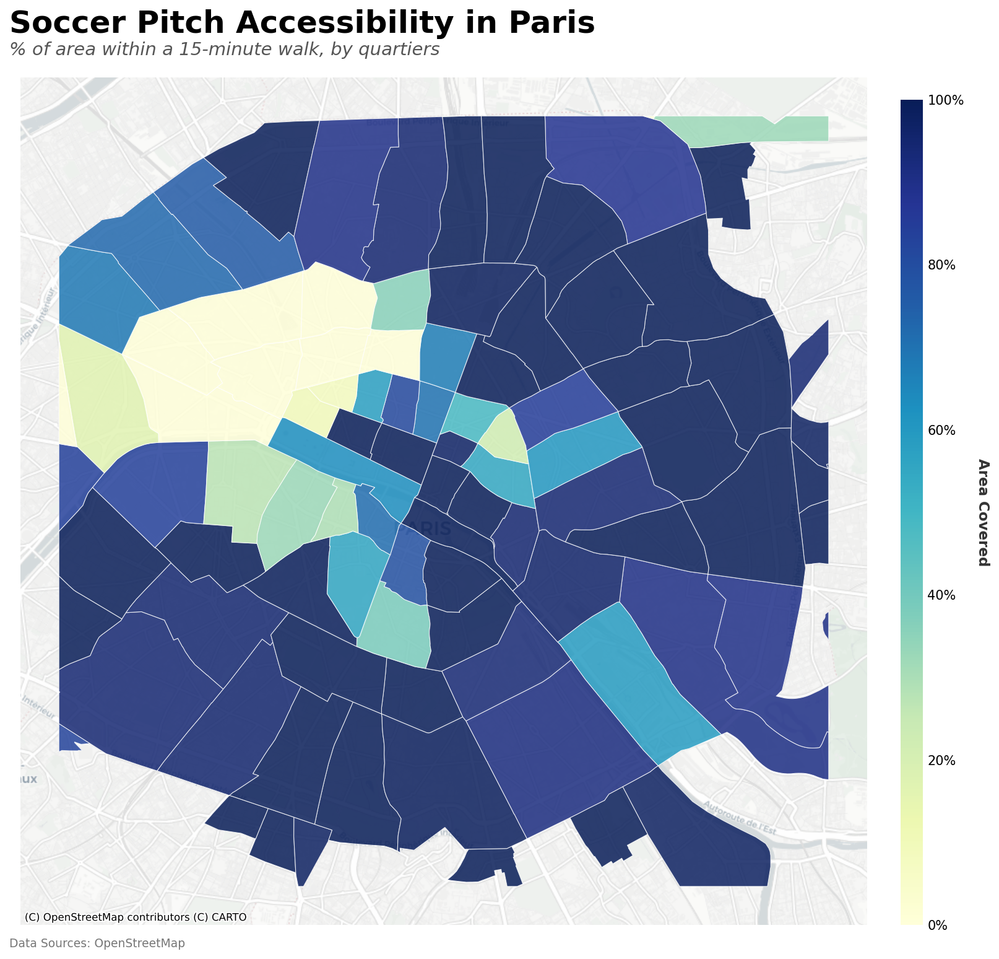

Temp

# Comparing NYC and Paris Soccer Pitch Accessibility

A spatial analysis evaluating urban recreational equity and 15-minute pedestrian accessibility to soccer pitches in New York City and Paris.

## Overview & Analysis

While acknowledging the vast differences in overall urban footprint and population density, a spatial analysis of the 15-minute walkability to soccer pitches reveals a stark contrast in urban recreational equity between the centers of Paris and New York City (within a 10 km square):

* **Paris (*mapped by quartiers*):** Demonstrates systemic, continuous coverage across the urban core, successfully reflecting a **"15-minute city"** planning model that lowers the barrier to entry for spontaneous play.
* **New York City (*mapped by Neighborhood Tabulation Areas*):** Exposes a highly fragmented **"zip-code lottery"**, where dense clusters of accessibility sit directly adjacent to severe infrastructure deserts, forcing many residents to rely on transit or planned leagues for basic recreational access.

## Visualizations

| Soccer Pitch Accessibility in NYC | Soccer Pitch Accessibility in Paris |
| :---: | :---: |
| *% of area within a 15-minute walk, by neighborhood* | *% of area within a 15-minute walk, by quartiers* |
|  |  |

---

## Methodology

This analysis quantifies pedestrian accessibility by calculating **15-minute walking catchment areas** around soccer pitches in both cities:

1. **Data Extraction:** Extracted pedestrian street networks and recreational points of interest (soccer pitches) using OpenStreetMap data with Python libraries including **GeoPandas** and **OSMnx**.
2. **Isochrone Modeling:** Applied network-routing algorithms to generate precise 15-minute walking isochrones along the actual physical street grid (rather than simple Euclidean/radius buffers).
3. **Coverage Masking:** Dissolved individual catchments into a unified accessibility coverage mask.
4. **Coordinate Reference Systems (CRS):** Reprojected all geographic data into local metric coordinate systems to ensure mathematically accurate area calculations:
   * **New York City:** `EPSG:2263` (NAD83 / New York Long Island)
   * **Paris:** `EPSG:2154` (RGF93 / Lambert-93)
5. **Spatial Aggregation:** Spatially intersected the coverage mask with administrative boundaries—official **Neighborhood Tabulation Areas (NTAs)** in NYC and **Quartiers** in Paris—to calculate the exact percentage of each district's land area falling within a 15-minute walk of a pitch.

---

## Tech Stack & Tools

* **Languages & Libraries:** Python, GeoPandas, OSMnx, Shapely, NetworkX, Matplotlib / Carto
* **Spatial Data Sources:**
  * OpenStreetMap contributors
  * NYC Department of City Planning
  * CARTO basemaps

---

## Sources

* Map Data: © [OpenStreetMap](https://www.openstreetmap.org/copyright) contributors
* Basemaps: © [CARTO](https://carto.com/attributions)
* Administrative Boundaries: NYC Dept. of City Planning / Ville de Paris
